[Home](./README.md)

## a) Prep: Introduction to SQL

In this course, I learned how to interact with an existing database. It begins with an introduction to the various components of an SQL query and then moves on to show how to alter a table (or schema) and create new tables from scratch. I learned a concept and performed an interactive exercise in each lesson. With this course, I have gained a solid foundation for using SQL in my own projects and for my future endeavors.

- SQL Lesson 1: SELECT queries 101

  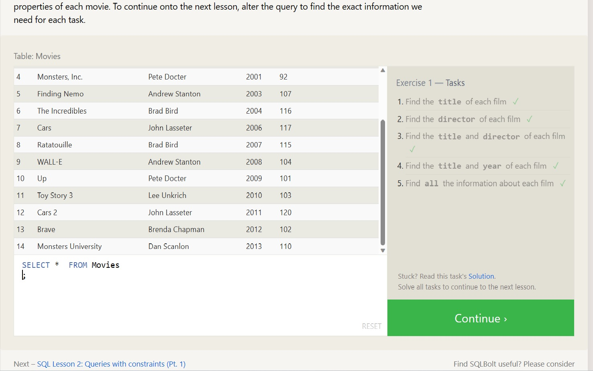
- SQL Lesson 2: Queries with constraints (Pt. 1)

  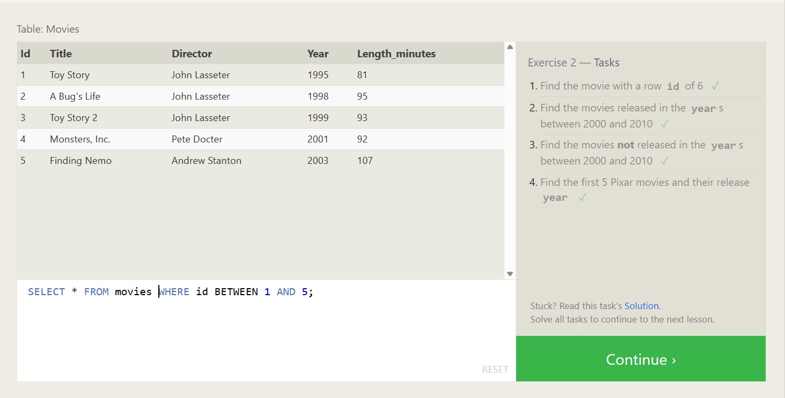
- SQL Lesson 3: Queries with constraints (Pt. 2)

  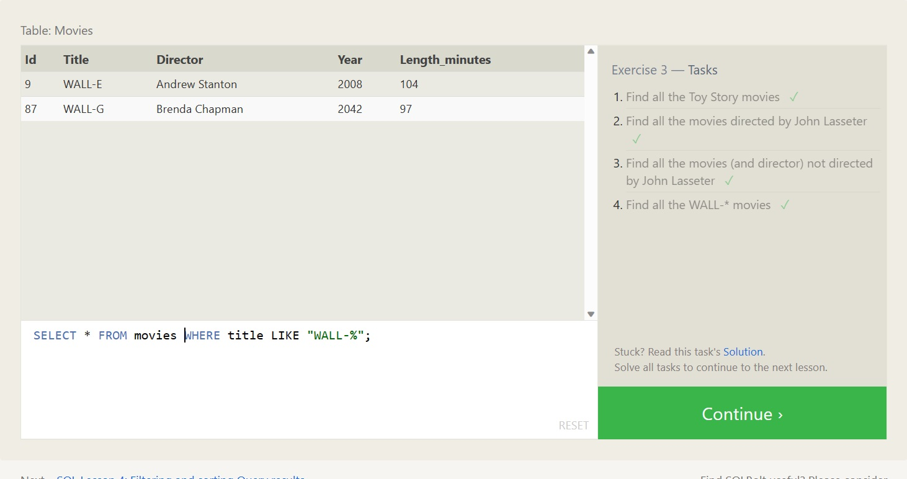
- SQL Lesson 4: Filtering and sorting Query results

  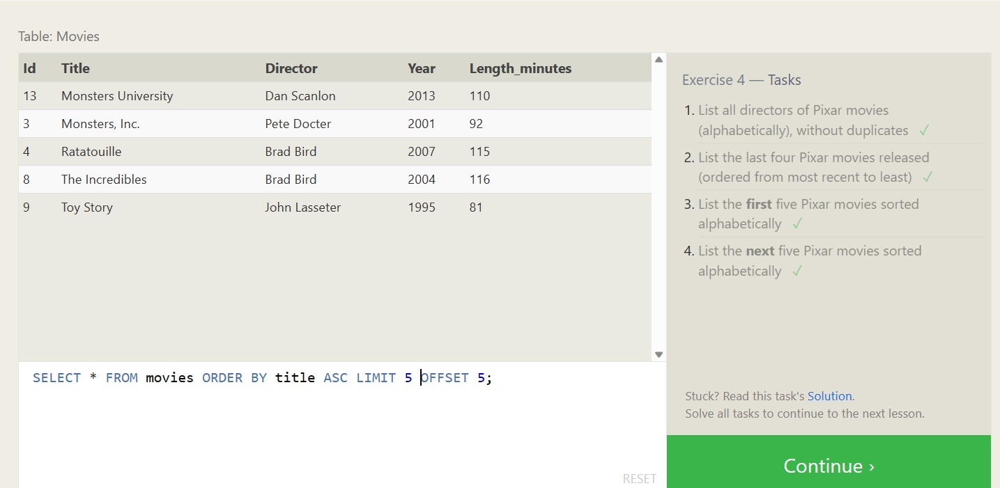

- SQL Review: Simple SELECT Queries

  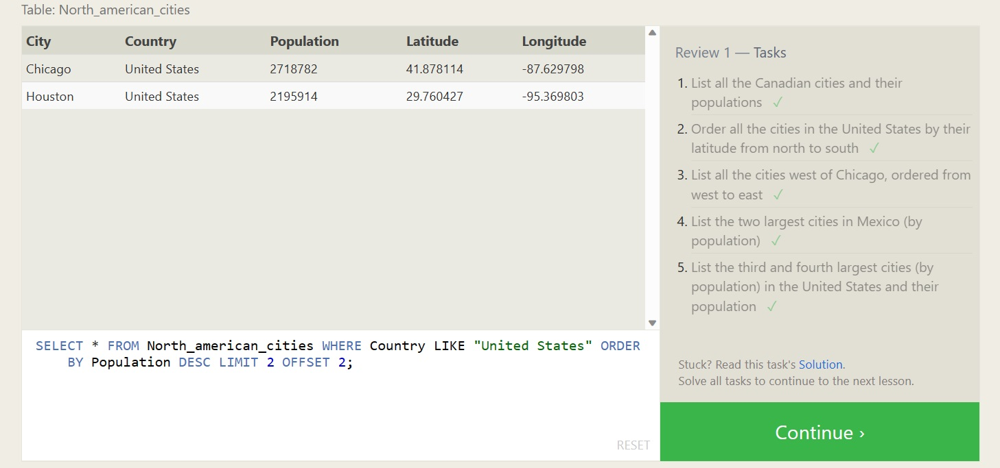

- SQL Lesson 6: Multi-table queries with JOINs

  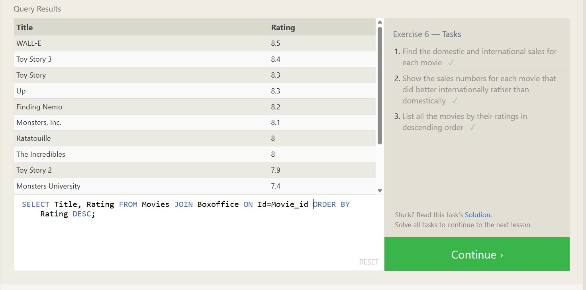

- SQL Lesson 13: Inserting rows

  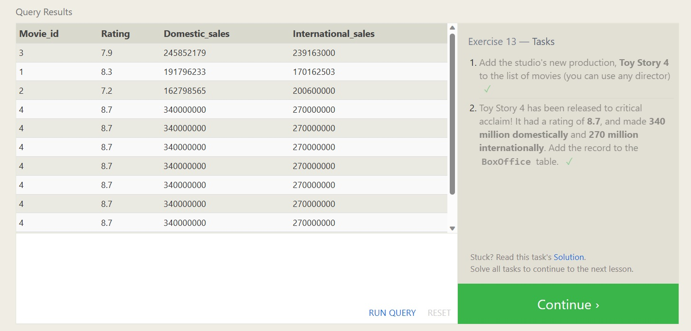

- SQL Lesson 14: Updating rows

  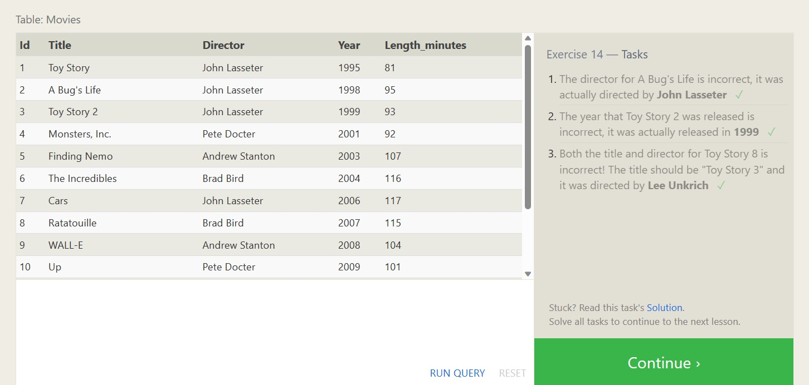

- SQL Lesson 15: Deleting rows

  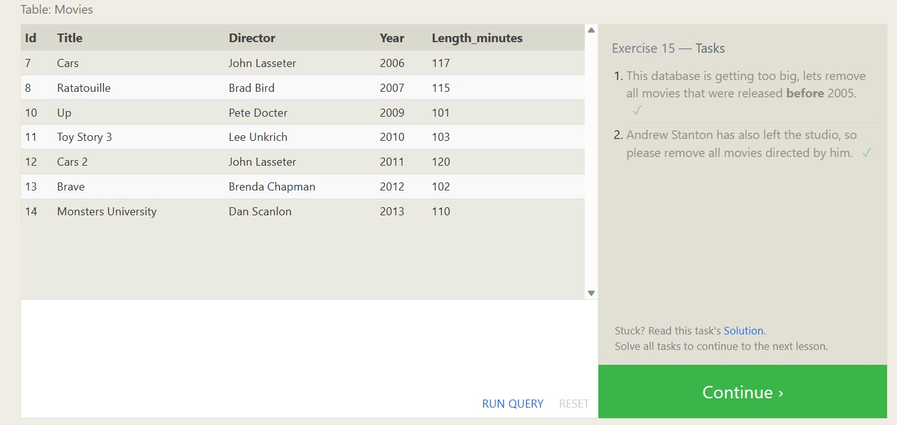

- SQL Lesson 16: Creating tables

  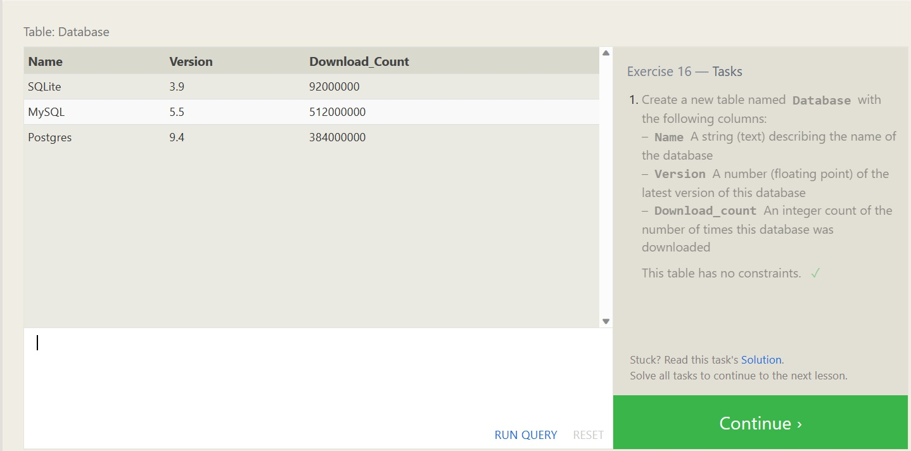

- SQL Lesson 17: Altering tables

  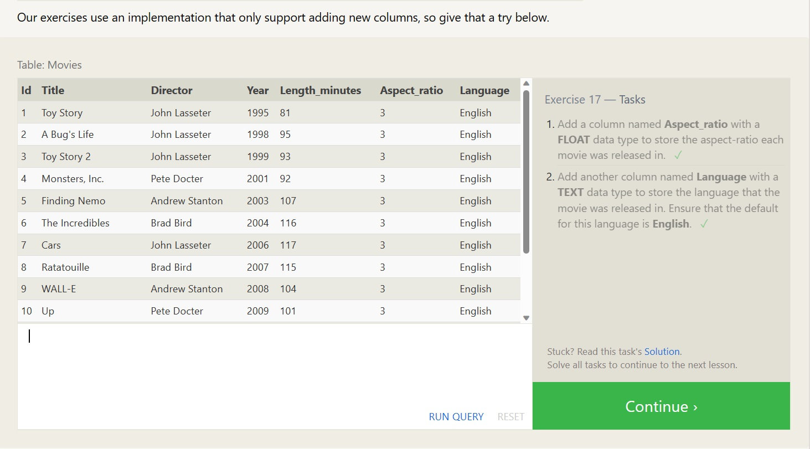

- SQL Lesson 18: Dropping tables

  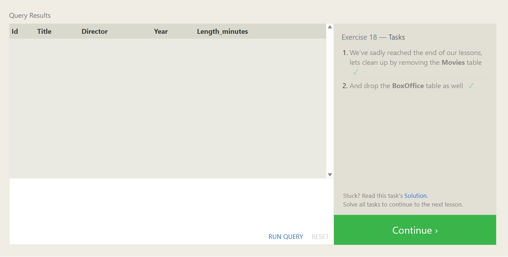

