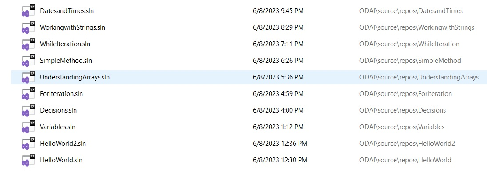
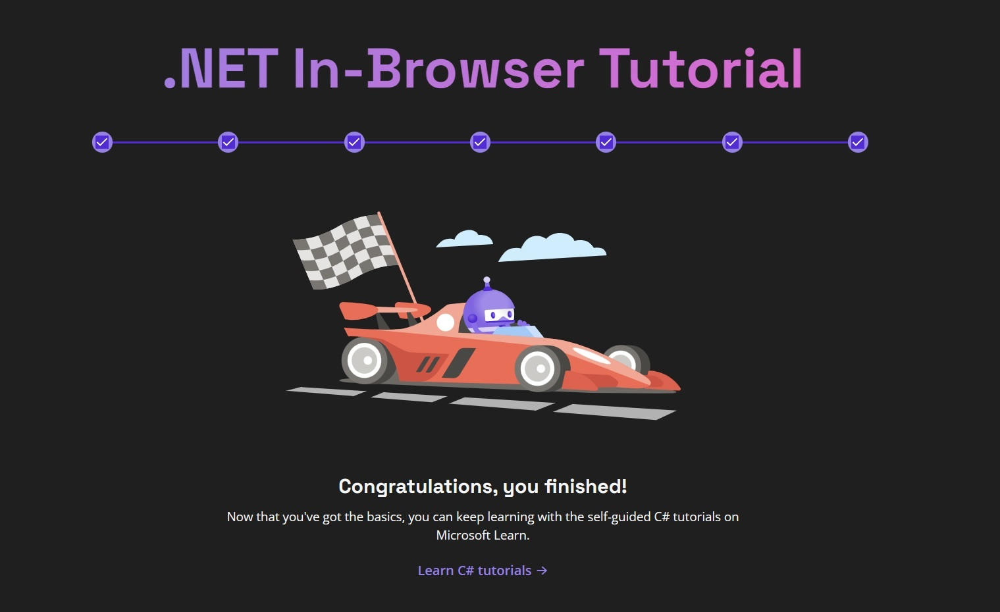
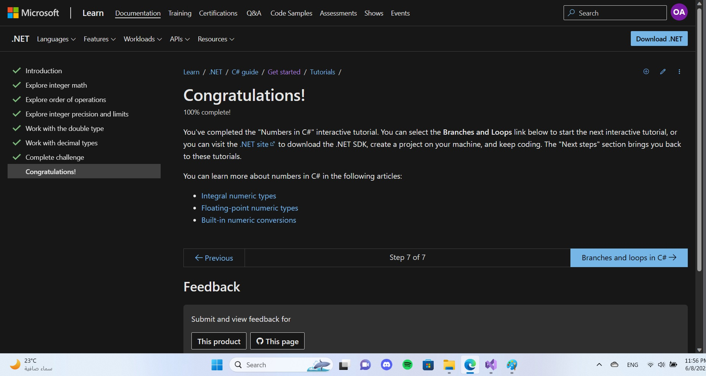
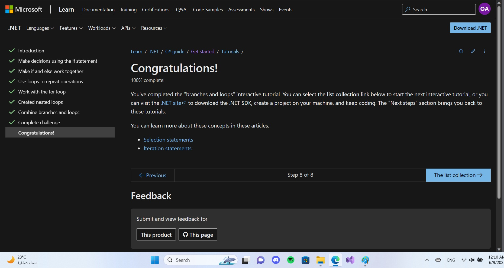
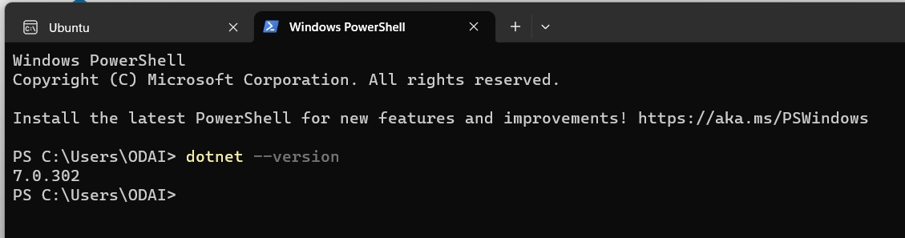

# Reading Notes
---
## ***Introduction*** 

I am *Odai Al-Obeidat*, I graduated with a ba*ch*elor's degree in ***civil engineering*** in 2017. In the following years, I studied a Ma**st**er's degree in ***Business Administration***, which I completed last year. Over the past few years, I have worked for a number of companies specializing in logistics services.I was rejected both times. To me, this course serves as a gateway to the administrative side of the field.

Documentation is one of the most important components of my study project. During this study, it will serve as a milestone for demonstrating my knowledge improvement as well as documenting my new learnings and highlighting them.

&nbsp;&emsp;

## ***Code 401 - Advanced Software Development***

&nbsp;&emsp;

&nbsp;&emsp;

# Table of Contents for this course

| Contents | Link |
| -------- | -------- |
| Read: Class 01 | [Read-Class01](./Read-Class01.md) |
| Read: Class 02 | [Read-Class02](./Read-Class02.md) |
| Read: Class 03 | [Read-Class03](./Read-Class03.md) |
| Read: Class 04 | [Read-Class04](./Read-Class04.md) |
| Read: Class 06 | [Read-Class06](./Read-Class06.md) |
| Read: Class 07 | [Read-Class07](./Read-Class07.md) |
| Read: Class 08 | [Read-Class08](./Read-Class08.md) |
| Read: Class 09 | [Read-Class09](./Read-Class09.md) |
| Read: Class 10 | [Read-Class10](./Read-Class10.md) |
| Read: Class 11 | [Read-Class11](./Read-Class11.md) |
| Read: Class 12 | [Read-Class12](./Read-Class12.md) |
| Read: Class 13 | [Read-Class13](./Read-Class13.md) |
| Read: Class 14 | [Read-Class14](./Read-Class14.md) |
| Read: Class 15 | [Read-Class15](./Read-Class15.md) |
| Read: Class 16 | [Read-Class16](./Read-Class16.md) |
| Read: Class 17 | [Read-Class17](./Read-Class17.md) |
| Read: Class 18 | [Read-Class18](./Read-Class18.md) |
| Read: Class 19 | [Read-Class19](./Read-Class19.md) |
| Read: Class 26 | [Read-Class26](./Read-Class26.md) |
| Read: Class 27 | [Read-Class27](./Read-Class27.md) |
| Read: Class 28 | [Read-Class28](./Read-Class28.md) |
| Read: Class 29 | [Read-Class29](./Read-Class29.md) |
| Read: Class 30 | [Read-Class30](./Read-Class30.md) |
| Read: Class 31 | [Read-Class31](./Read-Class31.md) |
| Read: Class 32 | [Read-Class32](./Read-Class32.md) |
| Read: Class 33 | [Read-Class33](./Read-Class33.md) |
| Read: Class 34 | [Read-Class34](./Read-Class34.md) |
| Read: Class 35 | [Read-Class35](./Read-Class35.md) |
| Read: Class 37 | [Read-Class37](./Read-Class37.md) |

&nbsp;&emsp;

&nbsp;&emsp;

# 1-Prework - Part 1

## a) Prep: DSA Practice
- I have watched the first 12 tutorials of the Microsoft Virtual Academy C# Fundamentals and applied all the work that has been done on them, and this image indicates the result, This gave me a good understanding of C# and Visual Studio.

   

- I have completed reading and applying in .NET in the browser, This gave me a good understanding of C#.
   - In Browser Tutorial

   

   - Numbers in C#

   

   - Branches and Loops 

   

## b) Prep: Computer Setup
- Done Windows OS is required
- Setup the Visual Studio Community Version and install .NET Core SDK.

## b) Prep: Read C# History
- A fter i study History of .NET and C#, Tooling and C# Language, i come up with this 5 points explain what you learned.

  1-The C# team is continuing to innovate and add new features, from (C# 1.0) 2002 up to (C# 11) 2022, where C# version 11 introduces generic math and several features that support that goal.

  2-It took me more than two hours to understand managed code and CLR, where CLR is part of the dot net framework it, it provides a layer of abstraction between a process running in memory and an application that runs inside that process, the CLR is like a real live translator between your source code and the operating system.

  3- C# is a managed language the code is managed by the CLR before it is executed, on the other the Unmanaged code is code that is executed outside the .NET runtime environment.

  4- we can avoid the new expression and the array type when you initialize an array on declaration, i think this will be save the time

  5- A jagged array is an array whose elements are arrays, possibly of different sizes.

#  2- Prework - Part 2

## a) Prep: Introduction to SQL

[Prep-Introduction-to-SQL](./Prep-Introduction-to-SQL.md) 

## b ) Prep: Practice in the Terminal

- Some tasks are best suited to a GUI, while others are more suited to the command line. For example, word processing and video editing are great examples of tasks that are best suited to a GUI. We Can open up a command line interface just as another window on their desktop. This is also to our advantage as we can have several command lines open and doing different tasks in each at the same time. 

- Many tasks rely on being able to get to or reference the correct location in the system and that as such, we can use pwd which stands for Print Working Directory, this will  tells me what my current or present working directory is. directories are actually just a special type of file and that it would be more accurate to say that a path is a means to get to a particular location in the system and that location is a file.

- Manual pages are a set of pages that explain every command available on my system, i can  search on the Manual pages which can be helpful if iam not quite sure of what command i may want to use. hand command line options begin with two dashes ( – ) and short hand options begin with a single dash ( - ).to creating a directory we use command we are after is mkdir which is short for Make Directory. 

## c ) Prep: The Growth Mindset

1- technical skills:
Upgrading technical skills with deliberate practice is important for me as a .NET software development employee because it improves my hard technical skills, exposes me to new opportunities, expands my knowledge into multiple fields and ultimately allows them to do more things with computers. in my previous work as technical support employees I learned how to solve problems by practicing and learning from my mistakes. also, I'm learned how to communicate technical ideas to non-technical people by breaking down complex ideas into simpler terms.

2- The power of believing that you can improve:
Believing that i can improve is important for me as .NET software development employees because it helps me to develop a growth mindset. A growth mindset is the belief that you can develop your abilities through hard work and dedication. This mindset can help me to learn new skills and technologies, take on new challenges, and ultimately become better developers. As for an analogy from my previous work experience as technical support, I would say that having a growth mindset is like being a technical support agent who believes that they can solve any problem with enough time and effort. I don’t give up easily when faced with a difficult issue but instead keep trying different solutions until I find one that works. 

3- The power of passion and perseverance:
The power of passion and perseverance is an important topic for me as .NET software development employees because it can help me stay motivated and focused on my work. When you’re passionate about what you do, you’re more likely to put in the time and effort needed to succeed. Perseverance is also important because it helps you overcome obstacles and challenges that you may encounter along the way. By combining passion and perseverance, I can achieve great things and make a real difference in my field.in my previous work as technical support agent I was passionate about helping customers and is willing to persevere through difficult issues until they are resolved. This approach helps me stay motivated and focused on my work, even when faced with challenging problems. 

4- A kinder, gentler philosophy of success:
A kinder, gentler philosophy of success is an important topic for me as a .NET software development employee because it can help me achieve my goals in a more sustainable and fulfilling way. Instead of focusing solely on external measures of success like money or status, this philosophy encourages people to prioritize their own well-being and happiness. By doing so, I can create a more positive and supportive work environment that fosters creativity, collaboration, and innovation. This can lead to better outcomes for everyone involved, including the company, its employees, and its customers.as a technical support agent i prioritizes customer satisfaction and well-being over metrics like call volume or resolution time. By doing so, they can create a more positive and supportive work environment that fosters creativity, collaboration, and innovation. This can lead to better outcomes for everyone involved, including the company, its employees, and its customers.

5- Measuring Emotional Intelligence Task: 23 from 25 
Emotional Intelligence is learnable and developmental by use feedback from others, mentoring within the organization or friendship circles, and books and seminars to develop in those areas.

6- Assessing Bias Tasks: 102 from 120
It seems that I have scored well in Assessing Bias Tasks. The results suggest that I have high self-awareness, curiosity, and courage.  It is important to be aware of these biases and examine where I still have room for improvement. These biases are learned assumptions, beliefs, or attitudes that exist in the subconscious and are developed over time as we accumulate life experiences and get exposed to different stereotypes.

 
 

## D ) Data Structures and Algorithms

[Data-Structures-and-Algorithms](./Data-Structures-Algorithms.md) 

## E ) Engineering Readings

[Engineering-Readings](./Engineering-Readings.md) 
