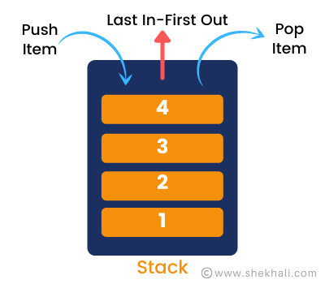

# Stacks And Queues

## why this topic matters as it relates to what Iam studying in this module?

because its are foundational data structures in c#, and we use it  instead of arrays/lists when we want the elements in a specific order, it can managed a large amount of data efficiently with ease, and it performe  operations such as insertion and deletion by ease way.

# Stacks
## Summary
Stacks are data structures made up of nodes. The next Node in the stack is referenced by each Node, but the previous Node is not referenced by any Node, and its LIFO.
LIFO : Last In First Out and it means that the Last item added to the stack will be the First item to be popped out of it.

 Stack terminology:
- Push ==> Nodes or items that are put into the stack are pushed.
- Pop ==> Nodes or items that are removed from the stack are popped.
- Top ==> This is the top of the stack.
- Peek ==> When you peek you will view the value of the top Node in the stack.
- IsEmpty ==> returns true when stack is empty otherwise returns false.

# Queues
## Summary
Queues are linear structures in which operations follow a defined sequence, and its FIFO.

FIFO : First In First Out and it means that the First item added to the stack will be the First item to be popped out of it.

Queue terminology: 

- Enqueue ==> Nodes or items that are added to the queue.
- Dequeue ==> Nodes or items that are removed from the queue. 
- Rear ==> This is the last Node of the queue.
- Front ==> This is the first Node of the queue.
- Peek ==> When you peek you will view the value of the front Node in the queue.
- IsEmpty ==> returns true when queue is empty otherwise returns false.

