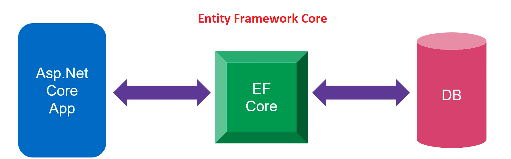
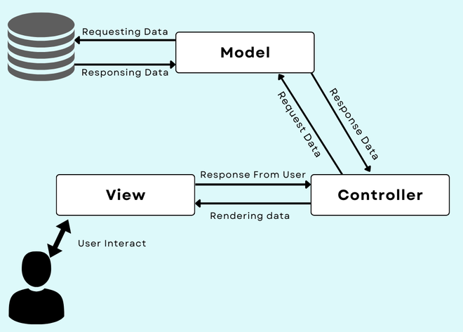
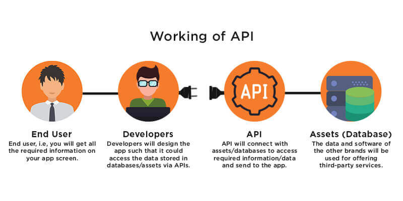

# Entity Framework and APIs

## why this topic matters as it relates to what Iam studying in this module?

.NET developers benefit from Entity Framework because it eliminates a lot of the data-access code that they normally have to write. using Entity Framework increases the our productivity as a developer's, In this way, we have the ability to manipulate data using objects of domain-specific classes without having to deal with the underlying database tables and columns. Regarding APIs, they are also vital to .NET developers because they can streamline resource and data sharing, control access through authentication and rights definition, and ensure safety.

# MVC with EF Get Started 

 

Create web app

 - Creating a new ASP.NET Core web application project in Visual Studio.

-  Enter ContosoUniversity for Project name. 

- In the Create a new ASP.NET Core web application dialog, select: 

- NET Core and ASP.NET Core 5.0

- ASP.NET Core Web App (Model-View-Controller).

- Create

## MVC

whene the Trygve Reenskaug create MVC the main goal of this design pattern was to solve the problem of users controlling a large and complex data set by splitting a large application into specific sections that all have their own purpose.is an design pattern that separates an application into three main logical components Model, View, and Controller. every specific development aspects of an application have architectural component to handle it . It isolates the business logic and presentation layer from each other.

The MVC framework includes the following 3 components:

- Controller

Controllers act as intermediaries between views and models by enabling the interconnection between them. The controller does not have to deal with data logic; it only instructs the model what to do. By using the Model component, it processes all the business logic and requests that are received, manipulates the data, and interacts with the View to render the final output.

- View

Views are utilized for all UI logic in an application. It creates a user interface for the user. Model data is used to create views, however, the data is not obtained directly from the model component, but rather via the controller. It only interacts with the controller.

- Model

Model is responsible for all data-related logic the user manipulates. Any data that is transferred between the View and Controller components or any data that is related to the business logic can be represented here. It can add or retrieve data from the database. It responds to the controller’s request because the controller can’t interact with the database by itself. The model interacts with the database and gives the required data back to the controller.

# APIs

he ASP.NET Web API is an extensible framework for building HTTP based services that can be accessed in different applications on different platforms such as web, windows, mobile etc. It works more or less the same way as ASP.NET MVC web application except that it sends data as a response instead of html view. It is like a webservice or WCF service but the exception is that it only supports HTTP protocol.

