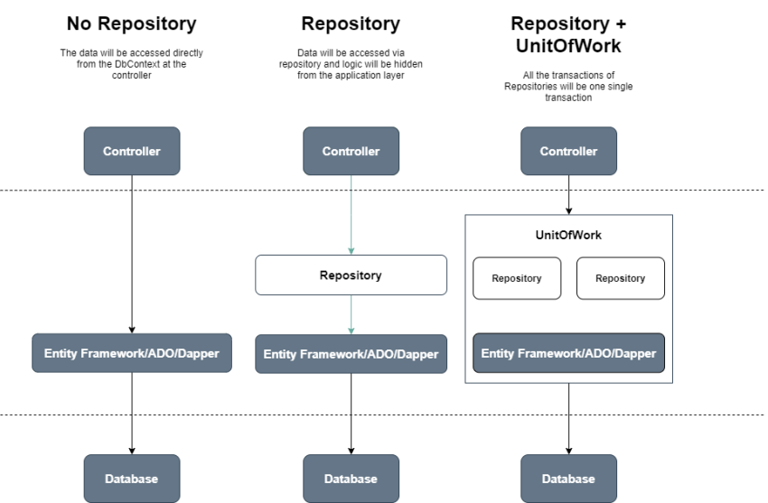
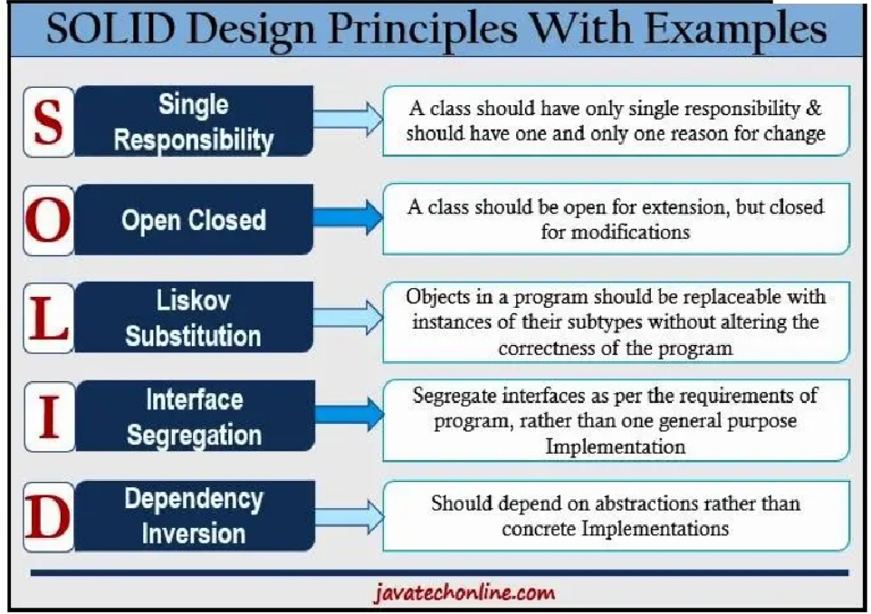

# Dependency Injection

## why this topic matters as it relates to what Iam studying in this module?

 Dependency injection is a built-in part of the framework in .NET, and its important to use because  it decouples our classes construction from construction of its dependencies, and make replace dependencies with mock objects or other implementations for testing purposes. of cours this will be easier to write unit tests for our code. we can use dependency injection container it like a map of dependencies that our class needs.

## Summary

Dependency Injection is the way to improves the reusability of our code and limits the ripple effect if you need to change lower level classes, this will remove the dependency by separating the usage from the creation of the object. In this way, boilerplate code is reduced and flexibility is improved.

There are several different styles of dependency injection:

- interface injection: It provides an injector method that will inject the dependency into any client passed to it. It is required that clients implement an interface that exposes a setter method for accepting dependencies.

- Constructor injection: Injectors provide dependencies through their constructors. During the creation of a class object, this parameter is used.

- Setter injection: Clients expose a setter method, which injectors use to inject dependencies.

# Repository Pattern

## why this topic matters as it relates to what Iam studying in this module?

The Repository pattern make your code more modular and easier to maintain. In addition, its minimizes duplicate query logic, decouples our application from persistence frameworks, promotes testability. 

## Summary

Repositories are collections of domain objects stored in memory.  The Repository pattern is mediates between the domain and data mapping layers, acting like an in-memory collection of domain objects. Using the Repository pattern, you can abstract how data is stored or retrieved from a database. A repository pattern was designed in order to decouple the data access layer from the business access layer of the application; this allows the operations layer to control the data access layer, By implementing the repository pattern, we create an abstraction layer between the data access layer and the business logic layer of a software application. This approach promotes a more loosely coupled approach to accessing data from databases.

# SOLID Principles

## why this topic matters as it relates to what Iam studying in this module?

The SOLID principles are important for .Net developer  because In this way, engineers are able to make changes to one area of software without affecting others. By following these principles, designs can be more easily understood, maintained and extended. 

## Summary

While the principles come with many benefits, following the principles generally leads to writing longer and more complex code. This means that it can extend the design process and make development a little more difficult. However, this extra time and effort is well worth it because it makes software so much easier to maintain, test, and extend. and this is what Martin say, and hwo martin, he is the guy developed the SOLID principles, and he say the  successful software will change and develop. As it changes, it becomes increasingly complex.

- Single Responsibility Principle: 
It means that each class only does one thing and every class or module only has responsibility for one part of the software’s functionality.

- Open-Closed Principle
And the idea is to modified the classes not chang it, becuase any changing in classes can lead to problems or bugs, we should be able to extend a class’s behavior without modifying it.

- Liskov Substitution Principle
This principle simply requires that every derived class should be substitutable for its parent class. 

- nterface Segregation Principle
is that it’s better to have a lot of smaller interfaces than a few bigger ones. Dealing with a smaller and more targeted interface makes developing against that service much easier.

- Dependency Inversion Principle 
developers should depend on abstractions, not on concretions, that mean the high level modules should not depend upon low level modules 

