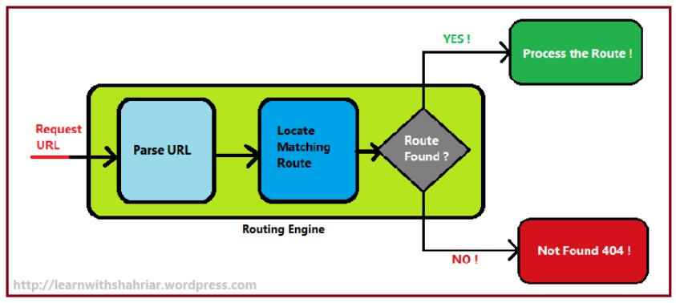

# Navigation Properties and Routing

## why this topic matters as it relates to what Iam studying in this module?

Routing is critical to ASP.NET Core, because in normal ASP.NET, there must be a match between the physical location and the URL. There will be an error 404 page not found if the file is not present. With Routing, it is not necessary for the file to physically be present at that location. Should the file not be present in the directory, the browser will search the entire project directory if it is not present. As a result of routing, if we call to the only controller, the index for that controller is automatically accessed.Routing makes your application more flexible in terms of pages and navigations.

# Routing within MVC && Routing within Core

## Summary

By using ASP.NET MVC routing, incoming browser requests can be mapped to certain actions that are defined in the MVC controllers. During the launch of the ASP.NET MVC application, one or more patterns are registered with the routing engine to inform it what to do with requests that match those patterns. Routing engines match incoming requests against URL patterns registered with them at runtime and respond accordingly.

## Properties of Route 
 
- Route Name: In web development, a route refers to a pattern of URLs that is associated with a handler. Handlers are controllers in MVC applications that handle requests. The name of a route may be used to refer to that route in particular.
 

- URL Pattern: There is a possibility of the URL pattern containing literal values as well as variable placeholders (also known as URL parameters). By slashing (/) the URL, literals and placeholders are delimited.

 
- Defaults: During the definition of a route, a default value can be assigned to a parameter. In the defaults object, there are default values for routes.
 
- Constraints: This is a set of constraints to apply to the URL pattern in order to narrowly define which URLs are matched.

## Apps can configure routing using

- Controllers
- Razor Pages
- SignlarR
- gRPC Services
- Endpoint-enabled middleware such as Health Checks
- Delegates and lambdas registered with routing.

Routing is handled by routing middleware, which matches the URLs of incoming requests to actions or other endpoints. Controller actions are either conventionally routed or attribute-routed. Conventional routing is similar to the route table approach used in ASP.NET MVC and Web API. Whether you’re using conventional, attribute, or both, you need to configure your app to use the routing middleware.

## Routing uses a pair of middleware

- UseRouting: adds route matching in the middleware pipeline.
- UseEndpoints: adds endpoint execution to the middleware pipeline.

