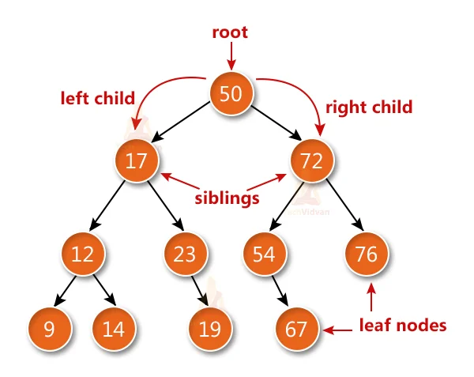
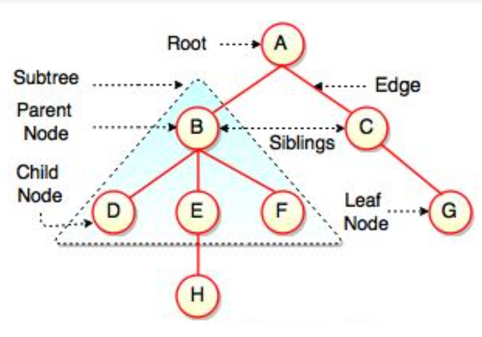

# lazy loading and eager loading

## why this topic matters as it relates to what Iam studying in this module?

Trees offer quicker search, insertion, and deletion than other data structures, such as linked lists, because of their shorter depth, and Trees do not have a fixed size like arrays, so they can grow and shrink as needed, making them very flexible, especially when dealing with dynamic data sets. 

## Summary

Trees are a powerful data structure with many applications. Trees are used in computer science for various tasks, including storing information, representing hierarchical data, and providing efficient algorithms for operations such as insertion, deletion, and searching.

## Types of Trees

1. General Tree: The most basic type of tree. It is made up of nodes that can have any number of child nodes and there is  no specific relationship between the nodes.

2. Binary tree: in this type every node can have no more than two child nodes. The left child node is always less than the parent node, and the right child node is always greater than or equal to the parent node. 

3. Binary Search Tree: Here every node has a value greater than all the values in its left subtree and less than all the values in its right subtree. 

4. AVL Tree: in this type each node has a value that is greater than all the values in its left subtree and less than all the values in its right subtree, and an AVL tree must also be balanced, meaning that the difference between the heights of the left subtree and right subtree must be no more than 1.

5. Red-Black Tree: Here each node has an extra bit associated with it that denotes its color (red or black), certain constraints must be met for an RBT to be valid

## Tree Parameters

- Root: 

   the node from where a Tree originates. A root has no parents. 

- Edge: 
THe connected element to some other element.

- Leaf node: 

  node without any children

- Siblings: 

  Multiple elements with same parent are known as siblings

- Ancestors: 

  when connection between the root node and a node q, and node lies between the path of root->q.

- Descendants: 

  Opposite of ancestor, where q will be the descendant of whatever node that lies in the path.

- Depth of a node: 

  It is the number of links it requires to reach to a particular node from the root.

- Height of Tree: 
  hTe distance between the root and the deepest node in tree.

- Size of a Node: 

  The number of descendants a node has including itself. 