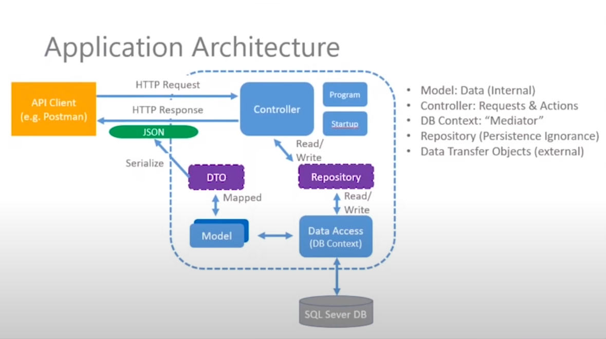

# Data Transfer Objects

## why this topic matters as it relates to what Iam studying in this module?

You would be asking what are the benefits of using DTOs if they are exactly the same as domain models now, the first thing is domain models can have slightly more properties and slightly different named properties, which we don't want to expose to our client so there are actually advantages of having DTOs because when we then we can manipulate our properties inside the details that we want to send back to the client. And using DTOs can help to improve the performance of an application, this is because they allow us to retrieve only the data that is needed, it also improves on security because DTOs can help us to increase security by limiting the amount of data that is provided to the client by only providing the necessary data you can reduce the risk of exposing sensitive data to unauthorized users. 

## Summary

DTOs are used to transfer data between different layers of components of an application. They are simple objects that typically contain a subset of the properties of a domain object or entity and are designed to be used for a specific purpose such as transferring data over the network or between layers of an application.   

Using DTOs, you can efficiently abstract domain objects from the presentation layer. It appears that your layers are correctly separated. It is possible to continue using the existing application and domain layers if you desire to completely change the presentation layer. If you desire, you may rewrite your domain layer, completely rewrite your database schema, entities, and O/RM framework, all without changing the presentation layer. 

For example, consider a User entity that has the properties Id, Name, EmailAddress, and Password. If the GetAllUsers() method of UserAppService returns a List<User>, anyone can view the passwords of all your users, even if they do not appear on the screen. Data hiding is not just about security, it is about securing data. It is important that application services return to the presentation layer the information it requires. There should be no more or less.
