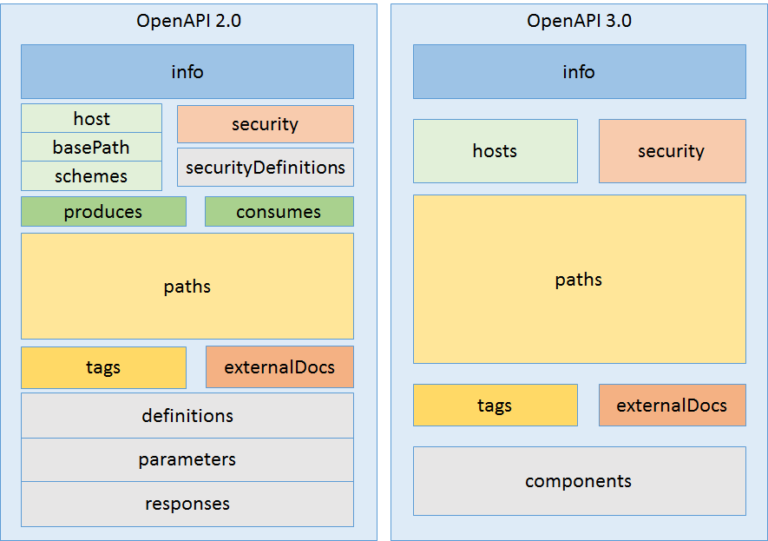
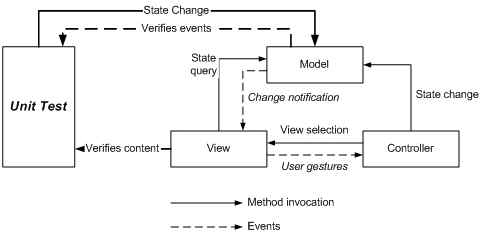

# Swagger

## why this topic matters as it relates to what Iam studying in this module?

In my role as a .Net developer, Swagger is crucial because it allows me to test API applications that include methods and controllers, where groups the methods of the API by controller.

## Summary

In general, Swagger (OpenAPI) is a specification that does not require a particular language to describe REST APIs. By using this method, humans and computers can understand the capabilities of a REST API without having direct access to its source code. With Swagger UI, you can provide information about the service using the OpenAPI specification that has been generated. The Swagger UI can be used as an alternative to Postman.The main goals of it to minimize the amount of work needed to connect decoupled services and reduce the amount of time needed to accurately document a service.

# Unit Testing and Testing Controllers

## why this topic matters as it relates to what Iam studying in this module?

The unit test controller in ASP.NET Core is an important tool for ensuring that your controller actions are valid. This tool can help you verify how your usecontroller behaves under different scenarios and inputs, and it can assist in finding and fixing bugs faster and more efficiently. It can also assist in maintaining your code and making it easier to read and understand.

## Summary

As a method of determining whether individual units of source code are suitable for use, unit testing is a method of software testing. Testing units has the primary objective of determining whether a piece of software that represents the smallest part of an application behaves as expected at the smallest level. To test the interfaces between modules, each unit is individually tested before integration into modules.Test Driven Development is fully supported in ASP.NET MVC, where you can write your test cases first, and on the basis of the test results, you can write your actual code for development. Before deploying any software that has a Data Access Layer or Business Layer, it should be tested. Tests of these layers indicate that you are moving in the right direction.

The preceding controller:

Utilizes the explicit dependency principle.

An instance of IBrainstormSessionRepository is expected to be provided by dependency injection (DI).

Using a mock object framework, such as Moq, it is possible to test a mocked IBrainstormSessionRepository service. Tests are conducted with mocked objects, which are fabricated objects with predetermined behavior properties and methods. Check out Introduction to integration tests for more information.

