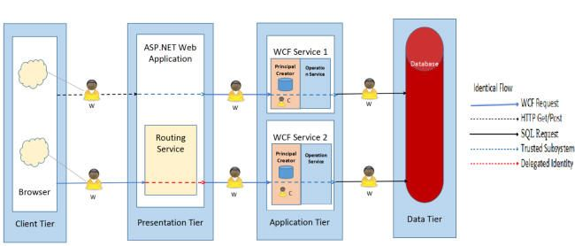

# Identity

## why this topic matters as it relates to what Iam studying in this module?

Identity is important for use as .NET developer because it allows use to handle user accounts, roles, permissions, and it supports various authentication methods, such as username/password.  

# Identity on ASP.NET Core

## Summary

In ASP.NET Core Identity, users can create and manage their login credentials. The Identity API enables you to log in and log out users, reset their passwords, lockout users, and implement multi-factor authentication. Additionally, it can be integrated with external login providers such as Microsoft Account, Facebook, Google, etc.

The ASP.NET Core identity can be installed when we create a new application by selecting the Individual Accounts option under the Authentication Type option. We automatically create most identity-related services and user interface forms, such as Register, Login, and Logout. The Two important Identity services are User Manager and Sign In Manager, User Manager where An instance of the UserManager class is responsible for managing the user. A User is created, updated, and deleted by this class. There are methods for finding a user by their User ID, User Name, or email address. The UserManager also offers the capability of adding and removing Claims, adding and removing roles, etc. As well as generating password hashes, it also validates users. and A sign-in manager is a class that handles user authentication in an application. A sign-in manager ensures that a user is authenticated when they sign in and out of an application. As a result, the user receives an authentication cookie.
 

# Authentication

## Summary

Many web applications will need to include the ability to restrict access to certain resources within the application to authorised users only. To do this, we need to authenticate users by letting them register and log in. this will let the server can determine which resources the user should access. Authentication refers to verifying the identity of a user based on the credentials provided by that user. We check user credentials, usually in the form of a user ID and password, in a database or an equivalent alternative, and if those credentials exist, we proceed to the next step of authorization.

