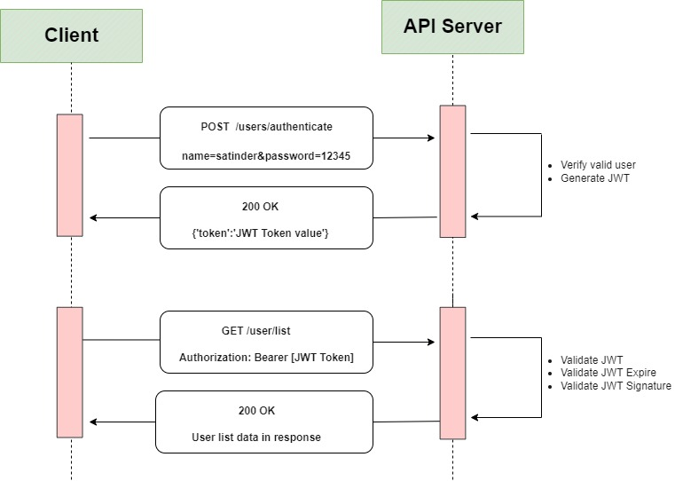

# Roles, Claims and JWT Tokens

## why this topic matters as it relates to what Iam studying in this module?

  In .NET development, authorization plays an important role in protecting the application's resources from unauthorized access, where Roles are a way of grouping users according to the common functions or responsibilities of an application. As a result, role-based authorization can be implemented easily and declaratively, allowing or restricting users' access to specific resources in a system based on their roles. This leads us to JWT tokens, which can be used to implement authentication and authorization for APIs.

# JWT Tokens

## Summary

 In this way, we make authorization more flexible and the user does not need to send his user data every time he wishes to action anything, as tokens such as keys or coins can be made and trusted by the server. The server gives it to the user after they sign up for the first time and the client stores it. It is an open standard that allows JSON objects to be transmitted securely and compactly between parties. It is important to note that it is possible to verify and trust the data transmitted between parties using JWT since it is digitally signed. In other words, when data is sent between two parties using JWT, it is digitally signed and can easily be verified and trusted. JWT allows us to implement authentication and authorization across any Web Application, whatever the backend stack is, such as ASP.NET Core, Java, NodeJS, Python, PHP, etc. 

# Roles

## Summary
The use of roles is regarded as a standard and common method of implementing authorization in applications. In an application, identities may contain roles and roles may contain permissions to perform actions. It is possible to assign multiple roles to a user. In the process of creating a user, he or she may be associated with one or more roles. There is a need for roles since, currently, if a user accesses any web application with only their user-id and password (i.e. without a role), then all users will have access to the application's features. In addition, limiting access to users based on their user IDs will be challenging as new users will be added over time and each change in access logic will be required.  

# Claims

## Summary

In order to determine the identity of the user, the user must provide a set of properties, such as the Unique Id, the Name, the Email Id, the Email Verified, etc. These properties are called claims. Claim sets consist of a set of properties that belong to a particular user. Claims contain information about the user that can be used to build a flexible authorization model.  There is only one fact about the user that is represented by a Claim. Any information that is true about the user, such as the user's first name, last name, age, employer, or birth date, may be included. There will only be one piece of information contained in a single claim. A claim describing John Smith's first name might be used as a representation of something about him. His last name, Smith, would be a second claim.

